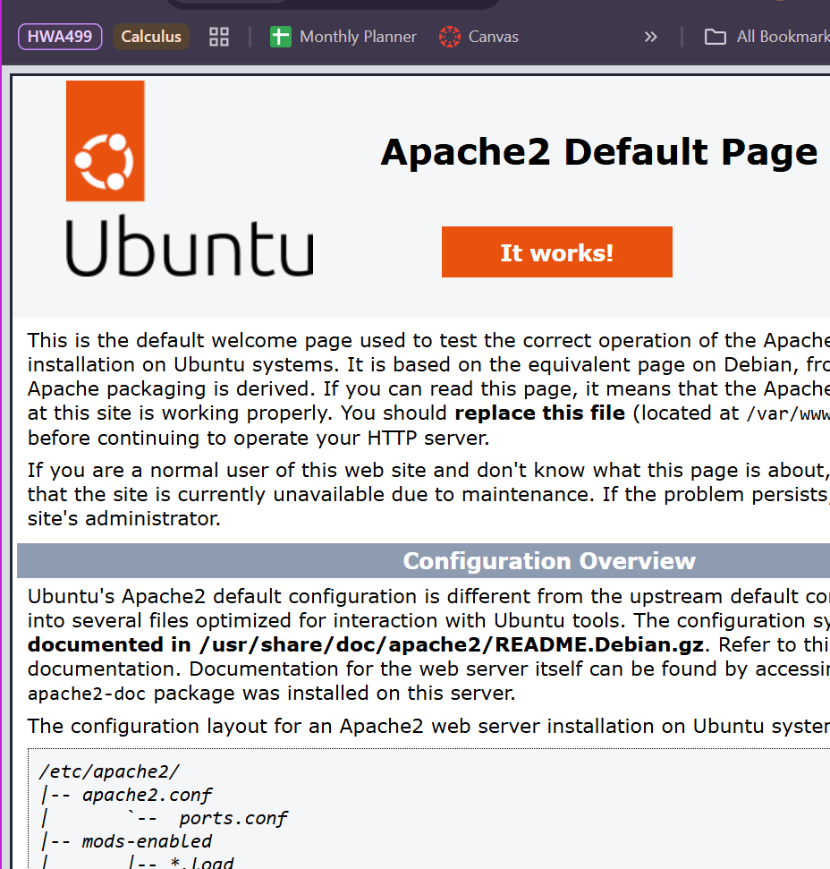
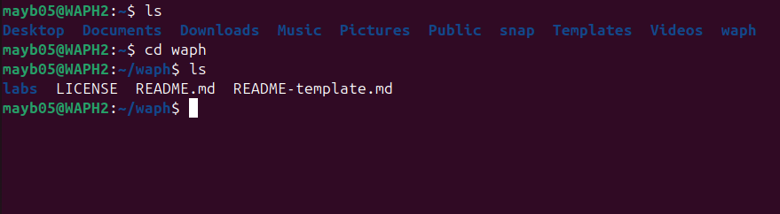
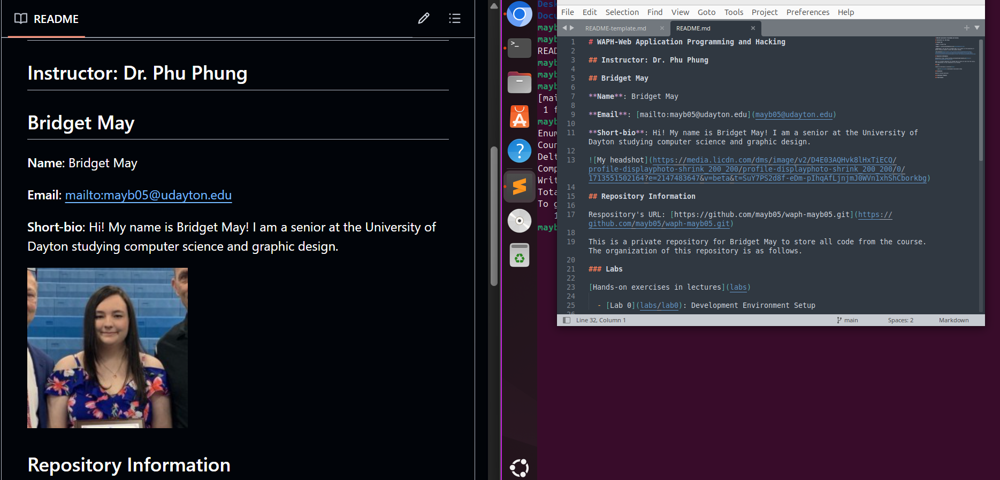

# WAPH-Web Application Programming and Hacking

## Instructor: Dr. Phu Phung

## Bridget May

**Name**: Bridget May

**Email**: [mailto:mayb05@udayton.edu](mayb05@udayton.edu)

**Short-bio**: Hi! My name is Bridget May! I am a senior at the University of Dayton studying computer science and graphic design. 

## Repository Information

Respository's URL: [https://github.com/mayb05/waph-mayb05.git](https://github.com/mayb05/waph-mayb05.git)

This is a private repository for Bridget May to store all code from the course. The organization of this repository is as follows.

### Lab 0 Overview

This lab has a focus on setting up our virtual environments. We worked with apache, virtualbox, git, and pandoc. 

#### Part 1 - Ubuntu VM and Software Install
We first installed virtualbox and set up a VM using Ubuntu 22.04. This was troublesome for me as I got stuck in the copying files part of the installation but it went through after some trials. We then changed some settings to allow fullscreen on the VM. Other software installed was git, pandoc + its dependencies, and sublime. We also installed Apache. 

##### Apache Web Server

#### Part 2 - Git Setup
##### Course Repo

##### Private Repo
I setup my private repo using github. I named it waph-mayb05 as instructed. I then generated an ssh key in order to clone my repository. I added the key to my github account then ran the clone command using the ssh link. I then copied the README template from the course repo to my personal repo and changed the needed information. I copied the link of my headshot from my LinkedIn profile.

