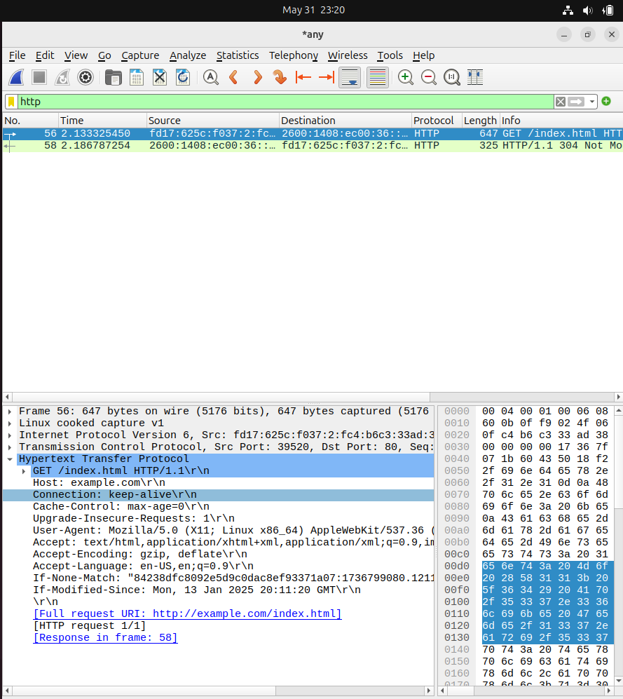
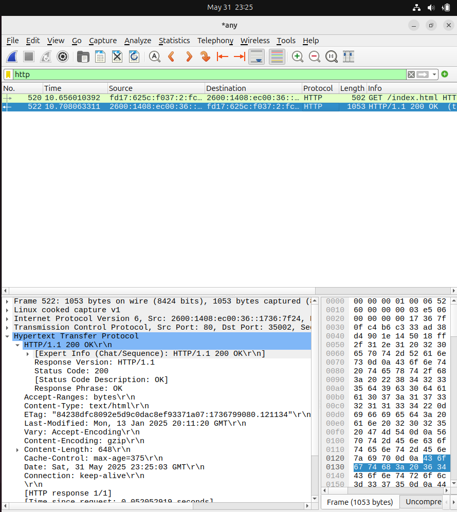
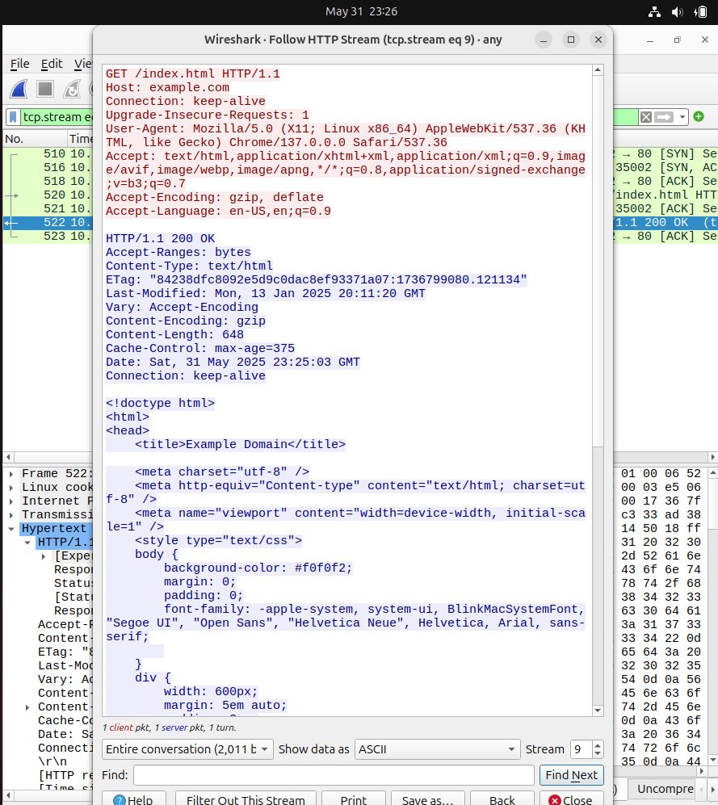
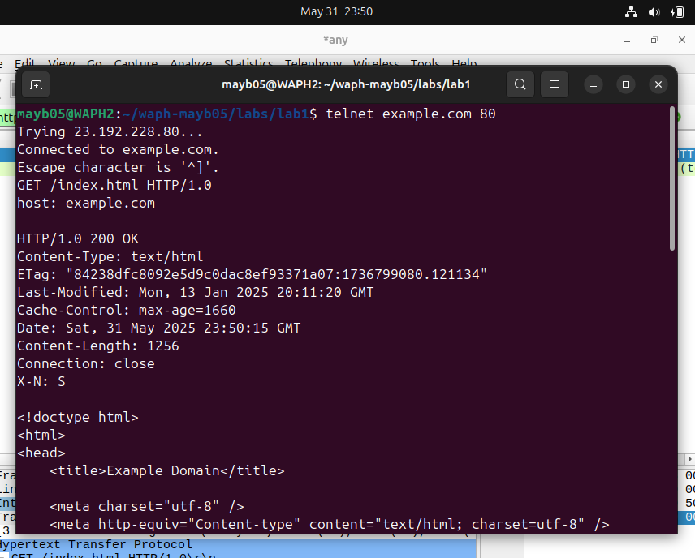
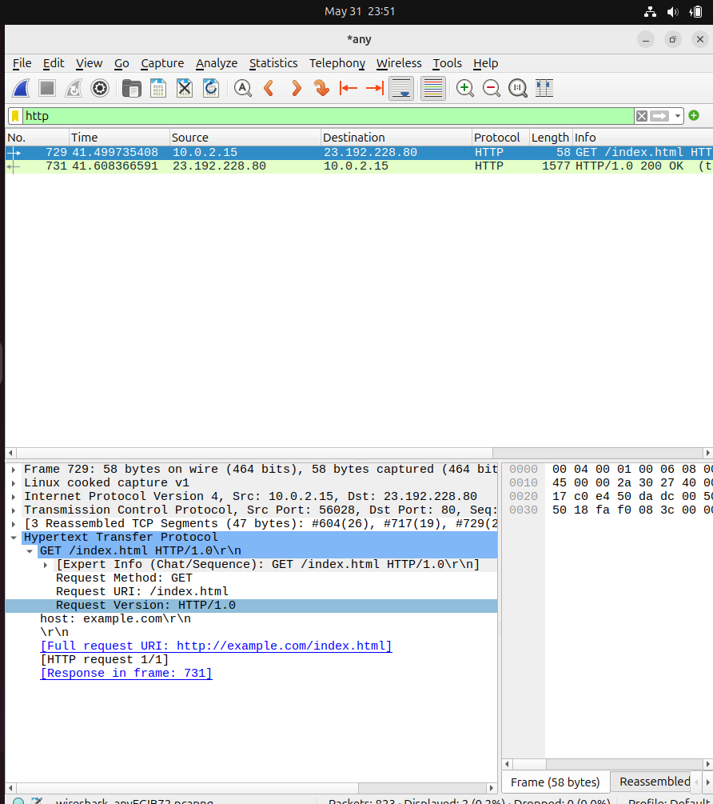
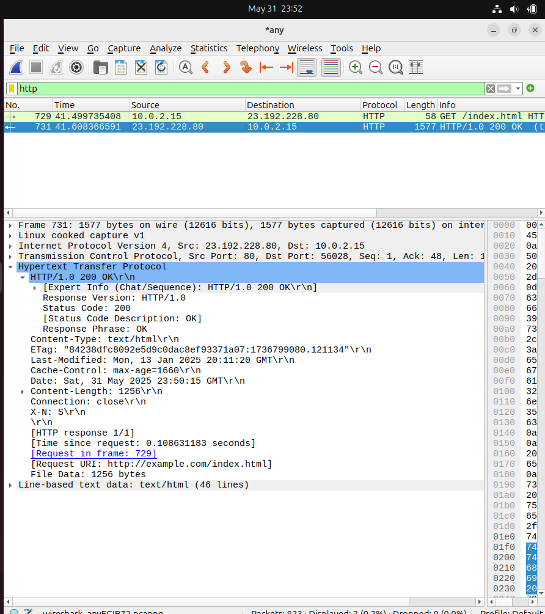

# WAPH-Web Application Programming and Hacking

## Instructor: Dr. Phu Phung

## Bridget May

**Name**: Bridget May

**Email**: [mailto:mayb05@udayton.edu](mayb05@udayton.edu)

**Short-bio**: Hi! My name is Bridget May! I am a senior at the University of Dayton studying computer science and graphic design. 

## Repository Information

Respository's URL: [https://github.com/mayb05/waph-mayb05.git](https://github.com/mayb05/waph-mayb05.git)

This is a private repository for Bridget May to store all code from the course. The organization of this repository is as follows.

### Lab 1 Overview
Lab link: [https://github.com/mayb05/waph-mayb05/tree/main/labs/lab1](https://github.com/mayb05/waph-mayb05/tree/main/labs/lab1)

#### Part 1 - The Web and HTTP Protocol
##### Task 1 - Wireshark and HTTP Protocol
To start this lab, I installed wireshark in order to view the exchange of packets when visiting example.com. The first thing I did was set the tool to look at any activity then filtered down to HTTP. Only my requests for example.com showed up. After doing this, I clicked on the GET Request to observe what behavior is displayed. Here is an image to capture this:

I then clicked on the Response message to note the differences in Response. At first I got the 304 error and had to clear my history and do the exercise a second time. We want the code 200.

Then I clicked right clicked the response and clicked follow-->HTTP to see the messages. Red text is requests and blue text is response.

##### Task 2 - Telnet and Wireshark
The first step was to clear the wireshark capture and then type the telnet command. The command is `telnet example.com 80` After doing so, I typed the Request needed and the host website. Here is a screenshot demonstrating this.

The next step was using wireshark to analyze the differences between using my web browser and telnet. The differences were that using the web browser, wireshark knew what my broswer was and had connection info while the telnet version had the barebones information. Here is the telnet request. 

I analyzed the response as well. The differences in response were that the telnet version did not have the accept-ranges field and also did not have the date of connection. 

#### Part 2 - Basic Web Apllication Programming
##### Task 1 - CGI Web Apps in C
placeholder
##### Task 2 - PHP with user input
placeholder
##### Task 3 - HTTP GET and POST requests
