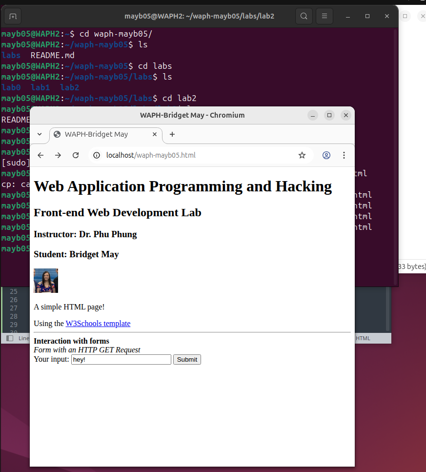
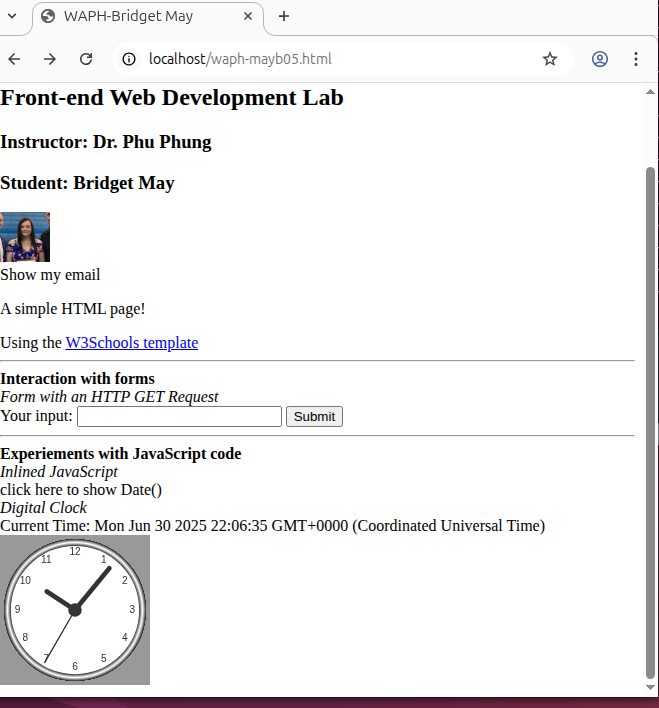
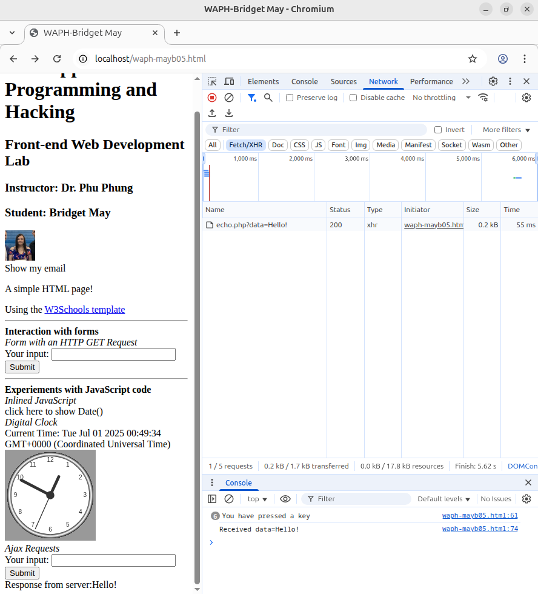
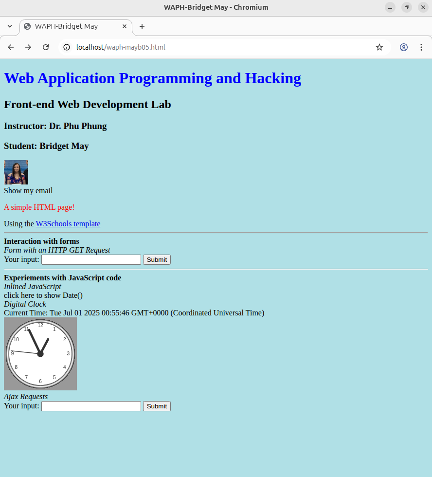
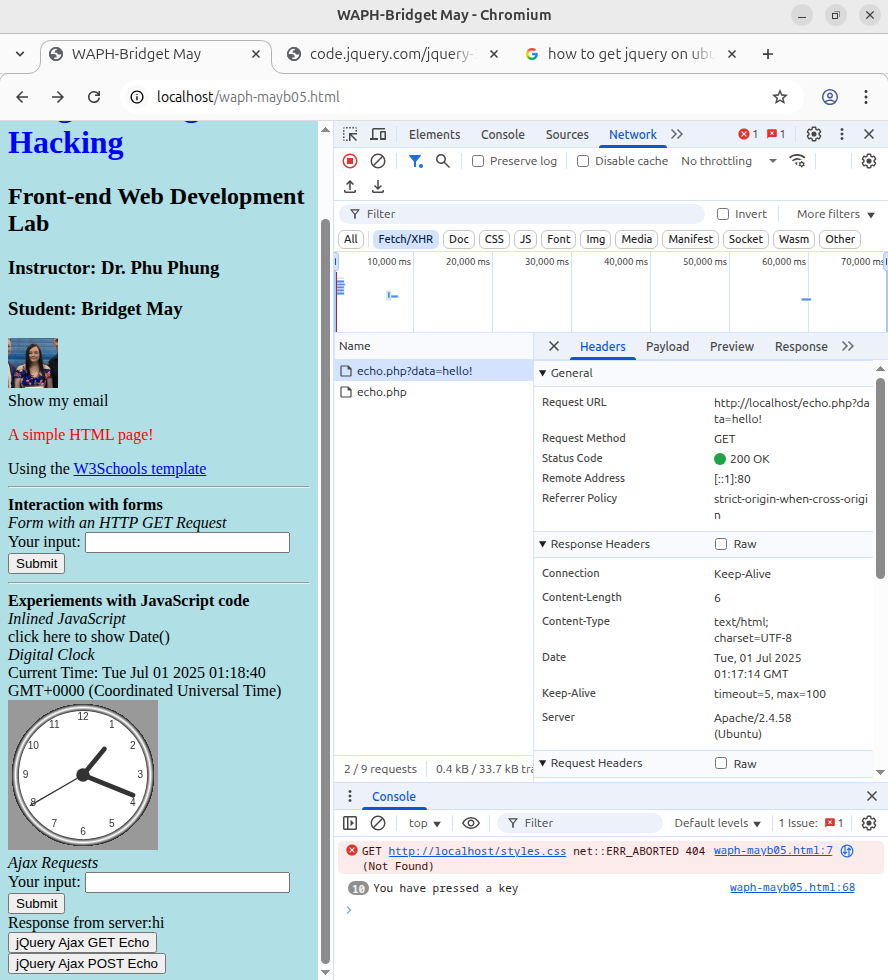
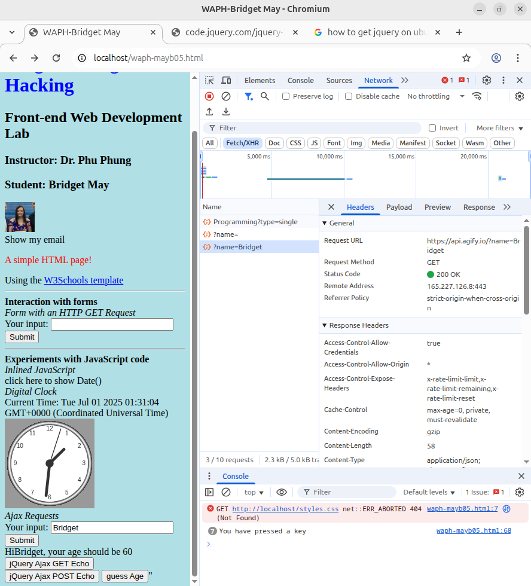

# WAPH-Web Application Programming and Hacking

## Instructor: Dr. Phu Phung

## Bridget May

**Name**: Bridget May

**Email**: [mailto:mayb05@udayton.edu](mayb05@udayton.edu)

**Short-bio**: Hi! My name is Bridget May! I am a senior at the University of Dayton studying computer science and graphic design. 

## Repository Information

Respository's URL: [https://github.com/mayb05/waph-mayb05.git](https://github.com/mayb05/waph-mayb05.git)

This is a private repository for Bridget May to store all code from the course. The organization of this repository is as follows.

### Lab 2 Overview
Lab link: [https://github.com/mayb05/waph-mayb05/tree/main/labs/lab2](https://github.com/mayb05/waph-mayb05/tree/main/labs/lab2)
In this lab, I created a simple HTML website that has my information as well as simple forms and css styling. Important functionalities were buttons, forms, and the time being shown. 

#### Task 1: HTML and JavaScript
##### a. HTML
Here is a screenshot to demonstrate my basic html page. It has my headshot and a form. 

##### b. Simple JavaScript

Here is my website after I added the javascript. I added a button to reveal my email. After clicking my email, it will direct you to email me! I also added two ways to see the date by using script tags and inline JavaScript. The last thing added was the remote script to make the analog clock. 

#### Task 2: Ajax, CSS, JQuery, and Web API integrations
##### a. Ajax

For this task, I used Ajax to view requests between the user and the server. The user can type anything into the Ajax requests box then submit and see it repeated back to them. You can inspect the network and see the request and also all of the key presses when the user types as well. 

##### b. CSS

I styled my website using CSS to give it a colorful look. The website refers to w3schools externally. The background comes from internal styles and the text of the "Lab" heading is from inline style. 

##### c. jQuery

For this task, I used jQuery to study the differences between GET and POST requests using jQuery. I made two new buttons to add to the Ajax Request that specifically used new methods for jQuery GET and POST requests. 

##### d. Web API Integrations

I integrated the joke and age api's into my website. I just had the joke load in with the clock then had the age load with the Ajax Request section. The age api uses fetch while the joke api uses Ajax. The API believes that I am 60. I am 22 but I feel 60 sometimes so I guess that makes sense. 
