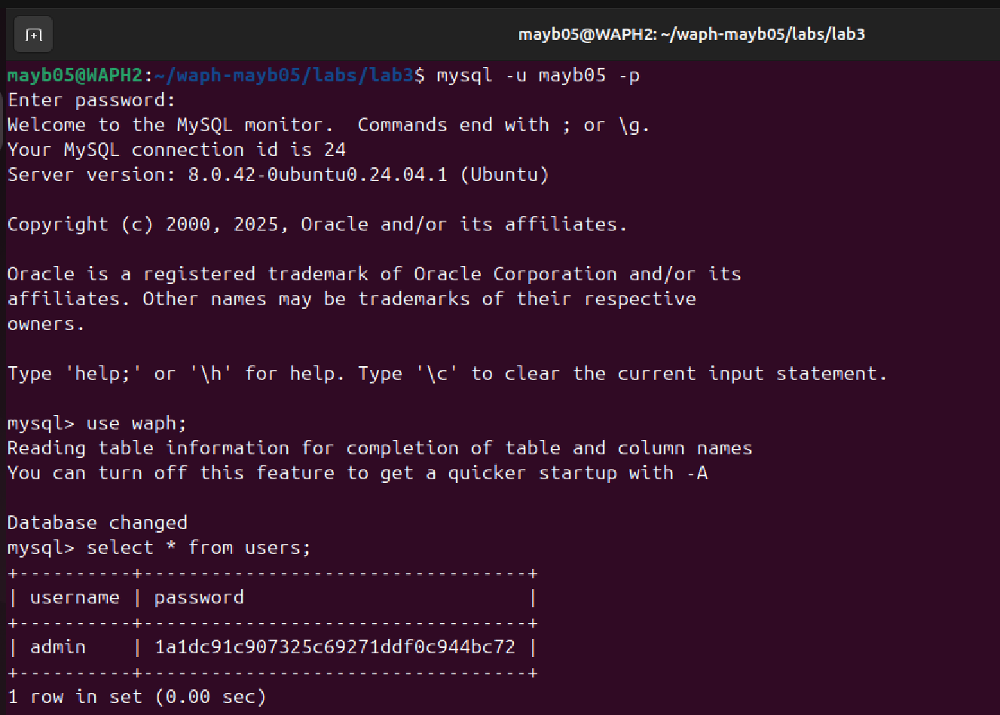
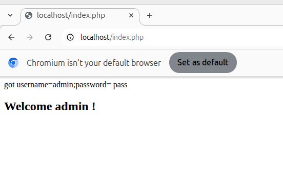
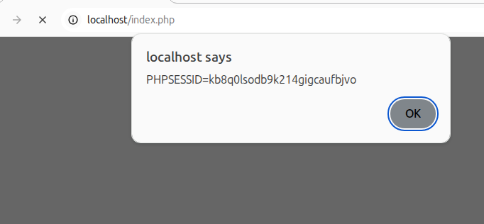
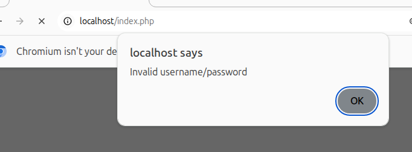

# WAPH-Web Application Programming and Hacking

## Instructor: Dr. Phu Phung

## Bridget May

**Name**: Bridget May

**Email**: [mailto:mayb05@udayton.edu](mayb05@udayton.edu)

**Short-bio**: Hi! My name is Bridget May! I am a senior at the University of Dayton studying computer science and graphic design. 

## Repository Information

Respository's URL: [https://github.com/mayb05/waph-mayb05.git](https://github.com/mayb05/waph-mayb05.git)

This is a private repository for Bridget May to store all code from the course. The organization of this repository is as follows.

### Lab 3 Overview
Lab link: [https://github.com/mayb05/waph-mayb05/tree/main/labs/lab3](https://github.com/mayb05/waph-mayb05/tree/main/labs/lab3)
In this lab, I experimented with PHP and MySQL code to create a simple login system connected to a database. I also tested the security of my code. 

#### Task 1: Database Setup
I setup my database by installing mysql and creating my own database account. It's important to not use the root account for database creation to avoid security issues. I used a schema file to create my database easily by importing the structure of my account rather than using the sql console.

#### Task 2: Simple Login system
For this task, We used index.php and form.php to create our website. The website connects to our database to allow logins and logouts. At this time you cannot create an account on the webpage. We changed the login function to our own to be able to connect the database to the login system. 

#### Task 3: Attack Demo
I performed an SQL injection attack as well as a Cross-site Scripting attack on my website to explore the code's vulnerablilites. These vulnerabilities come from the lack of input validation or sanitization of the username and password fields. The session id was also not protected.

#### Task 4: Prepared Statements
For this task, we are patching the vulnerabilities found in the code. Prepared statements can prevent SQL injection attacks by using placeholders instead of using the direct input of the user. It also prevents input being injected into the SQL logic by using precompiled SQL. 
