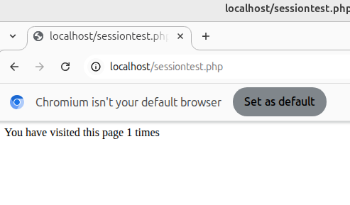
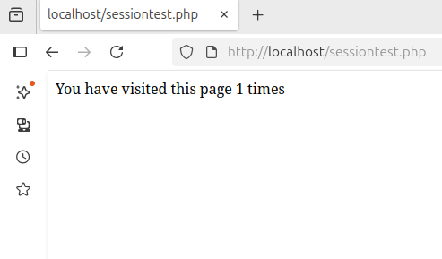
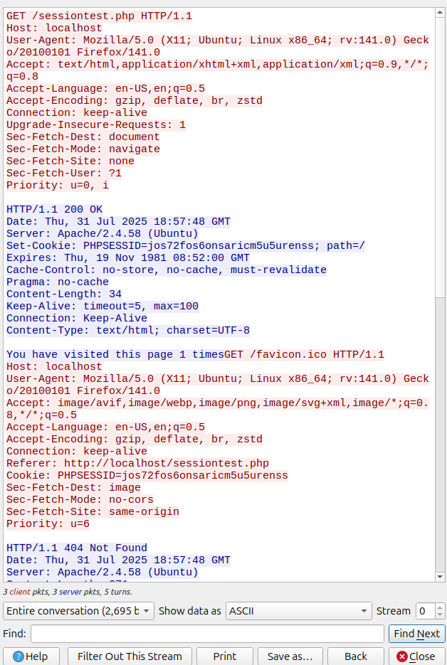
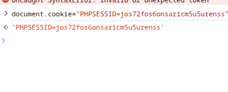
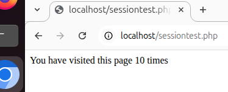

# WAPH-Web Application Programming and Hacking

## Instructor: Dr. Phu Phung

## Bridget May

**Name**: Bridget May

**Email**: [mailto:mayb05@udayton.edu](mayb05@udayton.edu)

**Short-bio**: Hi! My name is Bridget May! I am a senior at the University of Dayton studying computer science and graphic design. 

## Repository Information

Respository's URL: [https://github.com/mayb05/waph-mayb05.git](https://github.com/mayb05/waph-mayb05.git)

This is a private repository for Bridget May to store all code from the course. The organization of this repository is as follows.

### Lab 4 Overview
Lab link: [https://github.com/mayb05/waph-mayb05/tree/main/labs/lab4](https://github.com/mayb05/waph-mayb05/tree/main/labs/lab4)

In this lab, I focused on session management in PHP applications. I learned how to mitigate a session hijacking attempt and secured my application. I also used wireshark to help understand the web traffic when using sessions. 

#### Task 1: Session Management in PHP 101
##### 1a: Sessiontest.php
Here are the two different browser screenshots for the results of the code. 

##### 1b: Wireshark Observations
The session is set in the first screenshot then the cookie is held in the second one. 

##### 1c: Session Hijacking

#### Task 2: Insecure Session Auths
##### 2a: Revised Login System with Sessions
placeholder

##### 2b: Session Hijacking pt 2
placeholder

#### Task 3: Secure Sessions
##### 3a: Data Protection and Setup
placeholder

##### 3b: Securing Against Session Hijacking
placeholder

##### 3c: Defense in Depth
placeholder
